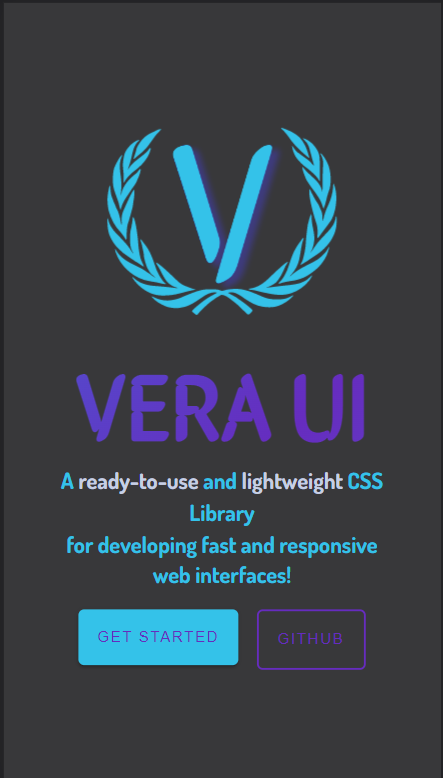

# [Vera UI - A CSS Component Library](https://vera-ui.netlify.app/)

A ready-to-use and lightweight CSS Library
for developing fast and responsive web interfaces!

<br />

## **Table of contents**

- [Overview](#overview)

  - [Usage](#usage)
  - [Documentation](#documentation)
  - [Screenshot](#screenshot)

- [My process](#my-process)
  - [Built with](#built-with)
  - [What I learned](#what-i-learned)
  - [Continued development](#continued-development)
  - [Useful resources](#useful-resources)
- [Author](#author)
- [Acknowledgments](#acknowledgments)

<br />

## **Overview**

<br />

### **Usage**

<br />

### **CSS**

Just copy-paste the stylesheet `<link>` into your `<head>` to load our CSS.

```html
<link rel="stylesheet" href="https://vera-ui.netlify.app/css/main.css" />
```

<br />

### **JS**

Some of our components require the use of JavaScript to function. Place our script at the end of your page content, right before the closing `<body>` tag, to enable them.

```html
<script src="https://vera-ui.netlify.app/js/main.js"></script>
```

<br />

### **Documentation**

Check out our **[documentation website](https://vera-ui.netlify.app/start.html)**.

<br /><br />

### **Screenshot**

 <br /><br />
<br /><br />
<br /><br />


<br />

## **My process**

### **Built with**

- Semantic HTML5 markup
- SCSS
- CSS3
- Flexbox
- Mobile-first workflow
- VanillaJS

<br />

### **What I learned**

**SCSS** is awesome!
I did use it once before but not on such a big scale. I learned that css can be optimized and it that is **clean** and **reusable**.
Large projects can really benefit from using SASS or SCSS.

<br />

One of the things that I loved about **SCSS** is how easy it is to nest elements. Also we can group various classes and tap them as a whole.

<br />

```css
.btn {
  padding: 1rem;
  cursor: pointer;
  color: red;
}
.btn:hover {
  background-color: blue;
}
.btn.btn-icon {
  padding: 1rem 1.5rem;
}
.btn.btn-icon span {
  padding: 0 0.5rem;
}
.btn.btn-primary {
  background-color: red;
  color: blue;
}
.btn.btn-primary:hover {
  background-color: blue;
}
.btn.btn-primary-outline {
  background-color: black;
}
.btn.btn-primary-outline:hover {
  background-color: red;
}
```

<br />

The above **CSS** code can be written in **SCSS** as below:<br /><br />

```scss
.btn {
  padding: 1rem;
  cursor: pointer;
  color: red;

  &:hover {
    background-color: blue;
  }
  &#{&}-icon {
    padding: 1rem 1.5rem;

    span {
      padding: 0 0.5rem;
    }
  }
  &#{&}-primary {
    background-color: red;
    color: blue;
    &:hover {
      background-color: blue;
    }

    &-outline {
      background-color: black;
      &:hover {
        background-color: red;
      }
    }
  }
}
```

<br />

### **Continued development**

- Light Mode
- Add new components
- Structured code in a better way
- Learn more about **functions** and **mixins** in SCSS
- Try to optimize more of the code

### **Useful resources**

- **[SCSS](https://sass-lang.com/)** - This helped me greatly in learning **SCSS** and its variety of features. I really liked the examples given in **SCSS** documentation which helped me a lot to transition from writing **CSS** to **SCSS**.

- **[SCSS to CSS](https://beautifytools.com/css-to-scss-converter.php)** - This helped me to figure out how to write some stuff in **SCSS** when I had a idea how to write in **CSS**.

## **Author**

- **Website** - [Sobhan dash](https://pranshudobhal.netlify.app/)
- **LinkedIn** - [sobhandash](https://www.linkedin.com/in/sobhandash/)
- **Twitter** - [@Neo_kaizerr](https://twitter.com/Neo_kaizerr)

## **Acknowledgments**

A big thanks to **[NeoGrammers](https://twitter.com/neogcamp)** for giving me an inspiration to create something on my own, even if I'm not a part of it. Its really great to see these guys build amazing stuff and put out content to get inspired from!
